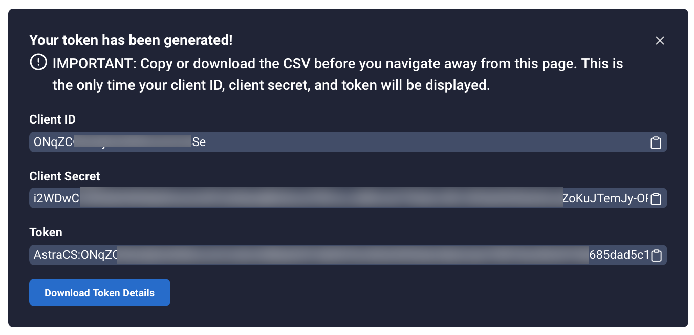

# DataStax Astra DB Plugin for HashiCorp Vault

Welcome developers, security and database administrators, site reliability engineers, and operators. 

This open-source project, DataStax Astra DB Plugin for HashiCorp Vault, adds robust **token lifecycle management** features for Astra DB. For those who may not be familiar, [Astra DB](https://docs.datastax.com/en/astra-serverless/docs/) is a serverless, multi-cloud native DBaaS built on Apache Cassandra&reg;. Due to the nature of the Astra DB object hierarchy, by default, API tokens are not associated with specific users and currently the tokens do not have metadata descriptions. 

Without the plugin, it's easy to lose track of:

* Who created tokens
* The purpose of each token
* Which tokens are being used actively 

Consequently, there's no audit trail of who has downloaded and used tokens, and there's no tracking regarding who may have manually shared tokens with others. 

Astra DB Plugin for HashiCorp Vault solves these security management issues. To ensure that your token ownership and usage are well understood, the plugin gives you the ability to associate metadata with tokens -- such as the user who created each token, and what it is being used for -- and logs who has accessed the tokens. 

Astra DB Plugin for HashiCorp Vault also gives you the ability to create and manage dynamic tokens outside of Astra Portal, which can then be used by your client applications that access Astra DB data. Using `vault` commands, authorized administrators can rotate tokens based on a token's lifetime lease. Specifically, you can: 

* Define a default lease time
* Create new tokens with lease settings
* List tokens by each one's Client ID
* View lease details
* List all leases
* Renew a lease
* Specify a lease duration during renewal
* Revoke a lease before it expires
* Delete a token

## What is HashiCorp Vault?

[HashiCorp Vault](https://www.hashicorp.com/products/vault) is a widely-used solution across the tech industry. It's an identity-based secrets and encryption management system. HashiCorp Vault provides key-value encryption services that are gated by authentication and authorization methods. Access to tokens, secrets, and other sensitive data are securely stored, managed, and tightly controlled. Audit trails are provided. HashiCorp Vault is also extensible via a variety of interfaces, allowing plugins (including Astra DB Plugin for HashiCorp Vault) to contribute to this ecosystem.

Astra DB Plugin for HashiCorp Vault is offered under the open-source [Apache 2.0](../LICENSE.txt) license.

## Available caller modes

Astra DB Plugin for HashiCorp Vault supports two caller modes, which determine the behavior of the plugin when creating tokens:

* *Standard*: Designed for applications that call the API directly without using a Vault agent. This mode is the default behavior.

* *Sidecar*: Designed for Vault agents running in a sidecar container. In this mode, the plugin API behaves as described in the [Vault Sidecar agent](https://developer.hashicorp.com/vault/docs/platform/k8s/injector) documentation. 

The major differences between the standard and sidecar caller modes:

* In `standard` mode, the `vault write` command generates new tokens. The `sidecar` mode does not support the `vault write` command.
* In `standard` mode, the `vault read` command gets an existing token's information from vault (also known as reading a token). The `sidecar` mode uses the `vault read` command to generate new tokens. 
* The `sidecar` mode does not support fetching the existing token's information. 

## Benefits

You can use Astra DB Plugin for HashiCorp Vault to: 	

* Log access to Astra DB tokens
* Create and revoke Astra DB tokens
* Associate metadata with Astra DB tokens for tracking purposes, in effect annotating each token's ownership &amp; purpose
* Rotate tokens based on a token's lifetime lease, using `vault` commands to set token lease defaults, expirations, renewals, and revocations to match your security requirements

For related details, see the [HashiCorp Vault](https://www.hashicorp.com/products/vault) documentation.

## Video introduction

Check out this introductory, YouTube-hosted video on the DataStax Developers channel:

[](https://www.youtube.com/watch?v=alcSZFcVvDk)

Running time: 4:32

## Prerequisites

### If you'll build or contribute to the plugin code

If you haven't already, clone this [GitHub repo](https://github.com/datastax/vault-plugin-secrets-datastax-astra). 

You will need:

* [Golang](https://go.dev/doc/install) v1.17.9+ installed.
* A fully functional configured HashiCorp Vault instance, including the ability to run the `vault` command.
* An Astra DB account with an administrator's role - see [Roles and Permissions](#roles-and-permissions).
* A *root token* for each Astra DB organization that HashiCorp Vault will manage; the steps are covered in this topic. 

### If you'll install and use the plugin binary

You will need:

* An Astra DB account with an admin role - see [Roles and Permissions](#roles-and-permissions).
* A *root token* for each Astra DB organization that HashiCorp Vault will manage; the steps are covered in this topic. 

## About root tokens

Astra DB Plugin for HashiCorp Vault will use the root token (per organization) to subsequently generate additional tokens. Sample `vault` commands are presented in this topic. 

For information first on how to generate tokens with Astra DB, see:

* [Managing tokens in Astra DB console](https://docs.datastax.com/en/astra/docs/manage/org/managing-org.html#_manage_application_tokens)
* Or, [managing tokens in DevOps API](https://docs.datastax.com/en/astra/docs/manage/devops/devops-tokens.html)

To create root tokens that are then authorized to create new tokens, your Astra DB account must have an admin role.

## Astra DB roles

Any of the following Astra DB roles can create root tokens:

* Organization Administrator (recommended)
* Database Administrator
* Service Account Administrator
* User Administrator

For more, see [user roles and permissions](https://docs.datastax.com/en/astra/docs/manage/org/user-permissions.html).

## Pricing

Astra DB Plugin for HashiCorp Vault is free. See the HashiCorp Platform Vault site for its [enterprise pricing](https://cloud.hashicorp.com/products/vault/pricing) details. 

<a name="build-steps"></a>
## Build steps - optional

If you elect to build the plugin from Go modules in our GitHub repo, follow these steps. Otherwise, you can use the provided binary.

1. Build the plugin:

	```bash
    CGO_ENABLED=0 go build -o vault/plugins/vault-plugin-secrets-datastax-astra cmd/vault-plugin-secrets-datastax-astra/main.go
	```
    *NOTE*: We recommend you set `CGO_ENABLED` to `0` to build a statically-linked binary, particularly in Kubernetes. If unset, the binary is dynamically-linked, and it may fail to register with Vault in some environments, such as Kubernetes. A statically-linked binary relies only on the system calls provided by the OS kernel and has no dependency on any shared libraries provided by the OS.

2. Enable the plugin in your Vault instance:

	```bash
	vault secrets enable -path=astra vault-plugin-secrets-datastax-astra
	```

	*Output*:

	```bash
	Success! Enabled the vault-plugin-secrets-datastax-astra secrets engine at: astra/
	```

3. In this step, configure the credentials Vault uses to generate tokens. Add a root token for each Astra DB organization. Specify the caller mode of the plugin (`standard` or `sidecar`). Standard is the default.

    Standard caller mode example:

    ```bash
    vault write astra/config org_id="<ORG ID>" astra_token="<YOUR ASTRA ADMINISTRATOR APP TOKEN>" 
      url="https://api.astra.datastax.com" logical_name="<YOUR LOGICAL NAME>" caller_mode="standard"
    ```

    Sidecar caller mode example:

    ```bash
    vault write astra/config org_id="<ORG ID>" astra_token="<YOUR ASTRA ADMINISTRATOR APP TOKEN>" 
      url="https://api.astra.datastax.com" logical_name="<YOUR LOGICAL NAME>" caller_mode="sidecar"
    ```

    *Output*:

    ```bash
    Success! Data written to astra/configs
    ```

## Setup plugin from binary distribution

1. Create a plugins directory where HashiCorp Vault will find the plugin. Example: `./vault/plugins`.  **IMPORTANT:** do not specify a symlinked directory.

2. Download the latest release Astra DB Plugin for HashiCorp Vault package for your operating system. In GitHub, navigate to the following directory, and click the relevant tarball to download it. Example: 

  https://github.com/datastax/vault-plugin-secrets-datastax-astra/releases/tag/v1.0.1

3. Unpack the binary and move its files to your plugin directory. 

4. Start Vault by using the [server](https://www.vaultproject.io/docs/commands/server) command. Example in a dev environment:

	```bash
	vault server -dev -dev-root-token-id=root -dev-plugin-dir=./vault/plugins -log-level=debug
	```

	**NOTE:** This example is for development environments. Do not start the HashiCorp Vault server in `-dev` mode in production.

	You may need to also set up the following environment variable:

	```bash
	export VAULT_ADDR='http://127.0.0.1:8200'
	```

5. Get the SHA-256 checksum of the plugin binary:

	```bash
	SHA256=$(sha256sum /private/etc/vault/plugins/vault-plugin-secrets-datastax-astra_1.0.1 | cut -d' ' -f1)
	```

6. Register the `vault-plugin-secrets-datastax-astra` plugin in the Vault system catalog, and use the version of the plugin you just downloaded:

	```bash
	vault plugin register -sha256=${SHA256} \
	  -command=vault-plugin-secrets-datastax-astra_1.0.1 \
	  -version=v1.0.1 \
	  secret vault-plugin-secrets-datastax-astra
	```

	**Output:**
	```bash
	Success! Data written to: sys/plugins/catalog/secret/vault-plugin-secrets-datastax-astra
	```

7. Enable the plugin in your Vault instance:

	```bash
	vault secrets enable -path=astra vault-plugin-secrets-datastax-astra
	```
	**Output:**
	```bash
	Success! Enabled the vault-plugin-secrets-datastax-astra secrets engine at: astra/
	```

At this point, HashiCorp Vault and Astra DB Plugin for HashiCorp Vault are set up. They're ready to use.


<a name="using-standard"></a>
## Standard caller mode - using Astra DB tokens with HashiCorp Vault

There are several tasks you can submit with HashiCorp Vault commands:

* Add a root token for each Astra DB organization
* Read and list configurations
* Generate HashiCorp Vault roles from Astra DB roles
* Generate new tokens, set the lease time, and attach meaningful custom metadata for your company's tracking and auditing purposes. Features include the ability to:
    - Define a default lease time
    - Create new tokens with lease settings
    - Renew a lease
    - Revoke a token/lease before the lease expires
    - Delete a token
* In addition, you can:
    - List a token by Client ID
    - List lease details
    - List all leases

In this example, assume a company has three Astra DB organizations:

* A retail org
* A wholesale org
* An internal usage org

*IMPORTANT*: As noted previously in this topic, here are the differences between `standard` and `sidecar` caller modes:

* In `standard` mode, the `vault write` command is used to generate new tokens. The `sidecar` mode does not support the `vault write` command.
* In `standard` mode, the `vault read` command is used to read a token; that is, get an existing token's information from vault. The `sidecar` mode uses the `vault read` command to generate new tokens. 
* The `sidecar` mode does not support fetching the existing token's information. 

*Follow these steps for `standard` mode.*  For the steps in `sidecar` mode, see [this section](#using-sidecar), which appears later in this topic.

1. If you haven't already, add a root token for each Astra DB organization. 

    Format:

	```bash
	vault write astra/config org_id="<ORG ID>" astra_token="<YOUR ASTRA ADMINISTRATOR APP TOKEN>" \
 	url="https://api.astra.datastax.com" logical_name="<YOUR LOGICAL NAME>" caller_mode="standard"
	```
  
	**TIP:** To get your `astra_token` value, in [Astra Portal](https://astra.datastax.com), login and go to Organization Settings > Token Management > Select Role: Organization Administrator. Click **Generate Token**. Copy the generated token from the resulting dialog. Example:

	

	Here's an example `vault` command to create a root token for the first organization:

	```bash
	vault write astra/config org_id="ccd999999_facd_4ad3_bbb99903d999999999999999d" \
	astra_token="AstraCS:ONqZCOAAAAAAAAAAAAAAAAe:608ba9999999999999190219" \
	url="https://api.astra.datastax.com" logical_name="retailOrg" caller_mode="standard"
	```
	**Output:**
	```bash
	Success! Data written to astra/configs
	```

	The created root token will be used by HashiCorp Vault for further token operations within this organization. 

2. List the created organization/token configurations:

	```bash
	vault list astra/configs
	```

	**Sample output:**
	```bash
	config/ccd999999_facd_4ad3_bbb99903d999999999999999d
	config/Some0therOrgId_aaa999999_bbbb_4ad3_ccc99903dd
	config/Y3tAnotherOrgId_aaa777777_bbbb_4ad3_ccc77777d
	```

3. Referring to the listed IDs, you can then submit read operation to get the defined properties. Example searching by `org_id`:

	```bash
	vault read astra/config org_id="ccd999999_facd_4ad3_bbb99903d999999999999999d"
	```

	**Sample output:**

	```bash
	Key                 Value
 	---                 -----
 	astra_token         AstraCS:ABcDeFg...
 	caller_mode         standard
	logical_name        org1
	org_id              ccd999999_facd_4ad3_bbb99903d999999999999999d
	url                 https://api.astra.datastax.com
	```

	You can also use the `vault read astra/config...` command to search by `logical_name`.

4. Use the installed token to automatically generate HashiCorp Vault roles from Astra DB roles:

	You can get a list of `role_id` values for an Astra DB organization by using the DataStax DevOps API. Example:

	```bash
	curl --request GET \
	 --url 'https://api.astra.datastax.com/v2/organizations/roles' \
	 --header 'Accept: application/json' \
	 --header 'Authorization: Bearer <application_token>'
	```

	Or you can run the [update_roles.sh](https://github.com/datastax/vault-plugin-secrets-datastax-astra/blob/main/update_roles.sh) script. It's provided in our GitHub repo. The script adds all the Astra DB roles (default and custom) and their IDs to HashiCorp Vault. The update_roles.sh script generates Vault roles from Astra DB roles with default `ttl` and `max_ttl` values (86400 seconds). Example:

	```bash
	sh vault/plugins/vault-plugin-secrets-datastax-astra/update_roles.sh
	```

5. To list the roles created across all your Astra DB organizations:

	```bash
	vault list astra/roles
	```

	You can also return the metadata for a specific role. Example:

	```bash
	vault read astra/role org_id="<ORG ID>" role="<ROLE NAME>"
	```

	Also available is the `vault delete astra/role org_id="<ORG ID>" role="<ROLE NAME>"` command.

6. To write a role, specify the `ttl` and `max_ttl`. The token for that role lives until the `ttl` expires for that role, and the token can be renewed until the `max_ttl` value is reached. If you do not specify the `ttl` or `max_ttl`, or their values are set to `0`, the default `ttl` and `max_ttl` values will be `86400` seconds. Example:

    ```bash
    vault write astra/role role_name="R_W_User" role_id="946cfbde-24cc-4953-9355-d57bfd61bf39" \
    org_id="ccd999999_facd_4ad3_bbb99903d999999999999999d" ttl=3600 max_ttl=36000
    ```

    *Output*:

    ```bash
    Success! Data written to: astra/role
    ```

    *NOTE*: After the role is created, you can change the defined `ttl` and `max_ttl` values by calling the same API with the same `role_name` and `org_id` arguments, and new `ttl` and/or `max_ttl` value(s).
	
7. To read a role:

    ```bash
    vault read astra/role org_id="ccd999999_facd_4ad3_bbb99903d999999999999999d" role_name="api_r_w_user"
    ```

    *Output*:

    ```bash
    max_ttl      10h0m0s
    org_id       ccd999999_facd_4ad3_bbb99903d999999999999999d
    role_id      946cfbde-24cc-4953-9355-d57bfd61bf39
    role_name    api_r_w_user
    ttl          1h0m0s
    ```

8. To generate a token:

    ```bash
    vault write astra/org/token org_id="<ORG ID>" role_name="<ROLE NAME>" logical_name="<LOGICAL NAME>"
    ```

    *NOTE*: Each token must have a unique combination of `org_id`, `role_name`, and `logical_name`.

    *Output*:

    ```bash
    Key                Value
    ---                -----
    lease_id           astra/org/token/ove4ll9sshXFL3qK6I1qPezb
    lease_duration     1h
    lease_renewable    true
    clientId           DTEUyKUZZrvFzzLzPGCbrbHO
    generatedOn        2022-09-21T17:48:15.260897295Z
    logicalName        org1
    metadata           <nil>
    orgId              ccd999999_facd_4ad3_bbb99903d999999999999999d
    roleName           r_w_user
    token              AstraCS:DTEUyKUZZrvFzzLzPGCbrbHO:4ebdef6dbbcada2f4618c9e4b6800c17b10c...
    ```

    After the lease expires, the token is automatically revoked; it's deleted from the Vault and from Astra DB.

9. To read a generated token using `client_id` and `org_id`:

    ```bash
    vault read astra/org/token client_id="ZenclHmfKBenxQZjRNhRUbLc" org_id="ccd999999_facd_4ad3_bbb99903d999999999999999d"
    ```
    
    *Output*:

    ```bash
    clientId       ZenclHmfKBenxQZjRNhRUbLc
    generatedOn    2022-09-21T17:40:29.265975403Z
    logicalName    org1
    metadata       <nil>
    orgId          ccd999999_facd_4ad3_bbb99903d999999999999999d
    roleName       r_w_user
    token          AstraCS:ZenclHmfKBenxQZjRNhRUbLc:a4bf8ca1bf164698e2631d353a295be27187e5750afc4080a4749fcc68f99f38
    ```

10. To read a token using `org_id`, `role_name`, and `logical_name`:

    ```bash
    vault read astra/org/token org_id=”ccd999999_facd_4ad3_bbb99903d999999999999999d” \
    role_name=”r_w_user” logical_name=”org1”
    ```

    *Output*:

    ```bash
    clientId       ZenclHmfKBenxQZjRNhRUbLc
    generatedOn    2022-09-21T17:40:29.265975403Z
    logicalName    org1
    metadata       <nil>
    orgId          ccd999999_facd_4ad3_bbb99903d999999999999999d
    roleName       r_w_user
    token          AstraCS:ZenclHmfKBenxQZjRNhRUbLc:a4bf8ca1bf164698e2631d353a295be27187e5750afc4080a4749fcc68f99f38
    ```

11. To list all Astra DB tokens:

    ```bash
    vault list astra/org/tokens
    ```

    *Output*:

    ```bash
    CtQUkZlxYDzoxydARnbhjlji
    YZZcEggpHvLPZQnnioYbZqLc
    rGQajQDqoPNyjtiokNNrIgPK
    ```

12. To force revoke a token before the lease expires:

    ```bash
    vault lease revoke <lease_id>
    ```

    The token is revoked; it's deleted from the Vault and from Astra DB.

13. To renew a token before the lease expires:

	```bash
    vault lease renew -increment=3600 <lease_id>
	```

	*Output*:

	```bash
    Key                Value
    ---                -----
    lease_id           astra/org/token/ove4ll9sshXFL3qK6I1qPezb
    lease_duration     1h
    lease_renewable    true
	```

    *NOTE*: The token can be renewed to a value no greater than `max_ttl`.


<a name="using-sidecar"></a>
## Sidecar caller mode - using Astra DB tokens with HashiCorp Vault

This section assumes you're using the plugin binary or you have optionally built the plugin from source (optional), using the steps described earlier in [this topic](#build-steps).

*REMINDER*: As previously noted:

* In `standard` mode, the `vault write` command is used to generate new tokens. The `sidecar` mode does not support the `vault write` command.
* In `standard` mode, the `vault read` command is used to read a token; that is, get an existing token's information from vault. The `sidecar` mode uses the `vault read` command to generate new tokens. 
* The `sidecar` mode does not support fetching the existing token's information. 

Given those differences, in this section we'll walk through the relevant steps and commands for users operating in `sidecar` mode. See the [previous section](#using-standard) for the commands in standard mode.

1. If you haven't already, add a root token for each Astra DB organization. In this section, notice we're specifying the `caller_mode` as `sidecar`. 

Format:

	```bash
	vault write astra/config org_id="<ORG ID>" astra_token="<YOUR ASTRA ADMINISTRATOR APP TOKEN>" \
 	url="https://api.astra.datastax.com" logical_name="<YOUR LOGICAL NAME>" caller_mode="sidecar"
	```
  
	**TIP:** To get your `astra_token` value, in [Astra Portal](https://astra.datastax.com), login and go to Organization Settings > Token Management > Select Role: Organization Administrator. Click **Generate Token**. Copy the generated token from the resulting dialog. Example:

	

	Here's an example `vault` command to create a root token for the first organization:

	```bash
	vault write astra/config org_id="ccd999999_facd_4ad3_bbb99903d999999999999999d" \
	astra_token="AstraCS:ONqZCOAAAAAAAAAAAAAAAAe:608ba9999999999999190219" \
	url="https://api.astra.datastax.com" logical_name="retailOrg" caller_mode="sidecar"
	```
	**Output:**
	```bash
	Success! Data written to astra/configs
	```

	The created root token will be used by HashiCorp Vault for further token operations within this organization. 

2. Read the config information by `org_id`:

	```bash
	vault read astra/config org_id="ccd999999_facd_4ad3_bbb99903d999999999999999d"
	```

	**Sample output:**

	```bash
	Key                 Value
 	---                 -----
 	astra_token         AstraCS:ABcDeFg...
 	caller_mode         sidecar
	logical_name        org1
	org_id              ccd999999_facd_4ad3_bbb99903d999999999999999d
	url                 https://api.astra.datastax.com
	```

	You can also use the `vault read astra/config...` command to search by `logical_name`.

3. Generate Vault roles from Astra DB roles with default `ttl` and `max_ttl` values (86400 seconds):

	```bash
	sh vault/plugins/vault-plugin-secrets-datastax-astra/update_roles.sh
	```

4. To list the roles created across all your Astra DB organizations:

	```bash
	vault list astra/roles
	```

5. To write a role, specify the `ttl` and `max_ttl`. The token for that role lives until the `ttl` expires for that role, and the token can be renewed until the `max_ttl` value is reached. If you do not specify the `ttl` or `max_ttl`, or their values are set to `0`, the default `ttl` and `max_ttl` values will be `86400` seconds. Example:

    ```bash
    vault write astra/role role_name="R_W_User" role_id="946cfbde-24cc-4953-9355-d57bfd61bf39" \
    org_id="ccd999999_facd_4ad3_bbb99903d999999999999999d" ttl=3600 max_ttl=36000
    ```

    *Output*:

    ```bash
    Success! Data written to: astra/role
    ```

    *NOTE*: After the role is created, you can change the defined `ttl` and `max_ttl` values by calling the same API with the same `role_name` and `org_id` arguments, and new `ttl` and/or `max_ttl` value(s).
	
6. To read a role:

    ```bash
    vault read astra/role org_id="ccd999999_facd_4ad3_bbb99903d999999999999999d" role_name="api_r_w_user"
    ```

    *Output*:

    ```bash
    max_ttl      10h0m0s
    org_id       ccd999999_facd_4ad3_bbb99903d999999999999999d
    role_id      946cfbde-24cc-4953-9355-d57bfd61bf39
    role_name    api_r_w_user
    ttl          1h0m0s
    ```

7. To generate a token, note how we use `vault read` ... in `sidecar` mode:

    ```bash
    vault read astra/org/token org_id="<ORG ID>" role_name="<ROLE NAME>" logical_name="<LOGICAL NAME>"
    ```

    *NOTE*: Each token must have a unique combination of `org_id`, `role_name`, and `logical_name`.

    *Output*:

    ```bash
    Key                Value
    ---                -----
    lease_id           astra/org/token/ove4ll9sshXFL3qK6I1qPezb
    lease_duration     1h
    lease_renewable    true
    clientId           DTEUyKUZZrvFzzLzPGCbrbHO
    generatedOn        2022-09-21T17:48:15.260897295Z
    logicalName        org1
    metadata           <nil>
    orgId              ccd999999_facd_4ad3_bbb99903d999999999999999d
    roleName           r_w_user
    token              AstraCS:DTEUyKUZZrvFzzLzPGCbrbHO:4ebdef6dbbcada2f4618c9e4b6800c17b10c...
    ```

    After the lease expires, the token is automatically revoked; it's deleted from the Vault and from Astra DB.

8. To list all Astra DB tokens:

    ```bash
    vault list astra/org/tokens
    ```

    *Output*:

    ```bash
    CtQUkZlxYDzoxydARnbhjlji
    YZZcEggpHvLPZQnnioYbZqLc
    rGQajQDqoPNyjtiokNNrIgPK
    ```

9. To force revoke a token before the lease expires:

    ```bash
    vault lease revoke <lease_id>
    ```

    The token is revoked; it's deleted from the Vault and from Astra DB.

10. To renew a token before the lease expires:

	```bash
    vault lease renew -increment=3600 <lease_id>
	```

	*Output*:

	```bash
    Key                Value
    ---                -----
    lease_id           astra/org/token/ove4ll9sshXFL3qK6I1qPezb
    lease_duration     1h
    lease_renewable    true
	```

    *NOTE*: The token can be renewed to a value no greater than `max_ttl`.


## Upgrade plugin from binary distribution

Plugin versioning was introduced in Vault 1.12, allowing for a smooth upgrade of the plugin that has been mounted at a path on a running Vault server. These steps assume you have already registered the plugins as outlined under "Setup plugin from binary distribution".

1. To upgrade the plugin, register a newer version of the plugin. You **must** use the same plugin type (secret) and name (vault-plugin-secrets-datastax-astra) as the plugin being upgraded:

	```bash
	vault plugin register -sha256=${SHA256} \
	  -command=vault-plugin-secrets-datastax-astra_1.0.1 \
	  -version=v1.0.1 \
	  secret vault-plugin-secrets-datastax-astra
	```

2. Tune the existing mount to configure it to use the newly registered version:

	```bash
	vault secrets tune -plugin-version=v1.0.1 vault-plugin-secrets-datastax-astra
	```

3. If you want, you can check the updated configuration. Notice the "Version" is now different from the "Running Version":

	```bash
	vault secrets list -detailed
	```

4. As the final step, trigger a plugin reload. This will reload all mounted backends using that plugin:

	```bash
	vault plugin reload -plugin vault-plugin-secrets-datastax-astra
	```

## Summary

HashiCorp Vault has a full understanding of the historical token specifics, for control and auditing purposes, including when the tokens were used and by whom, along with a free-form role name and any custom metadata you may have associated with the tokens. For example, HashiCorp Vault's data knows the details of the token delete operation via its identity management and access control data; whereas Astra DB is only aware that a token of a particular `clientId` was generated on a date, and has since been deleted.

## Community contributions

Astra DB Plugin for HashiCorp Vault is an open source project. In this GitHub repo, use [Issues](https://github.com/datastax/vault-plugin-secrets-datastax-astra/issues) to report a problem or share an idea. You may suggest ideas for improvement or bug fixes. [Clone the repo](https://github.com/datastax/vault-plugin-secrets-datastax-astra) and submit a Pull Request (PR) on a separate fork and working branch. This OSS project is a community effort - we encourage and appreciate contributions!

## What's next

See the following resources:

* [Video introduction](https://youtu.be/alcSZFcVvDk) on YouTube 
* [HashiCorp Vault](https://www.hashicorp.com/products/vault) documentation
* [How to generate tokens in Astra DB](https://docs.datastax.com/en/astra-serverless/docs/manage/org/managing-org.html#_manage_application_tokens) 
* [Astra DB user permissions](https://docs.datastax.com/en/astra-serverless/docs/manage/org/user-permissions.html)
